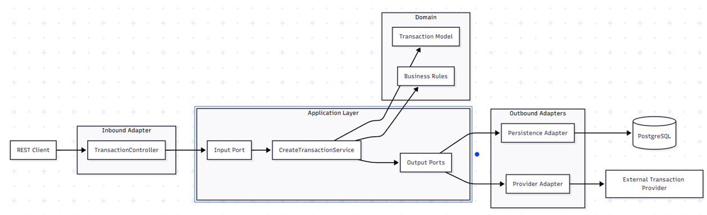
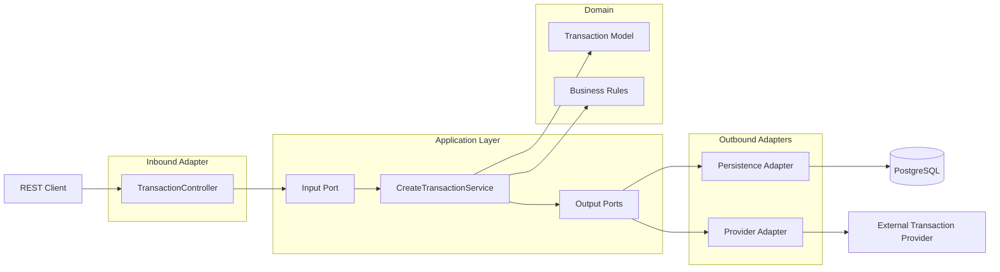
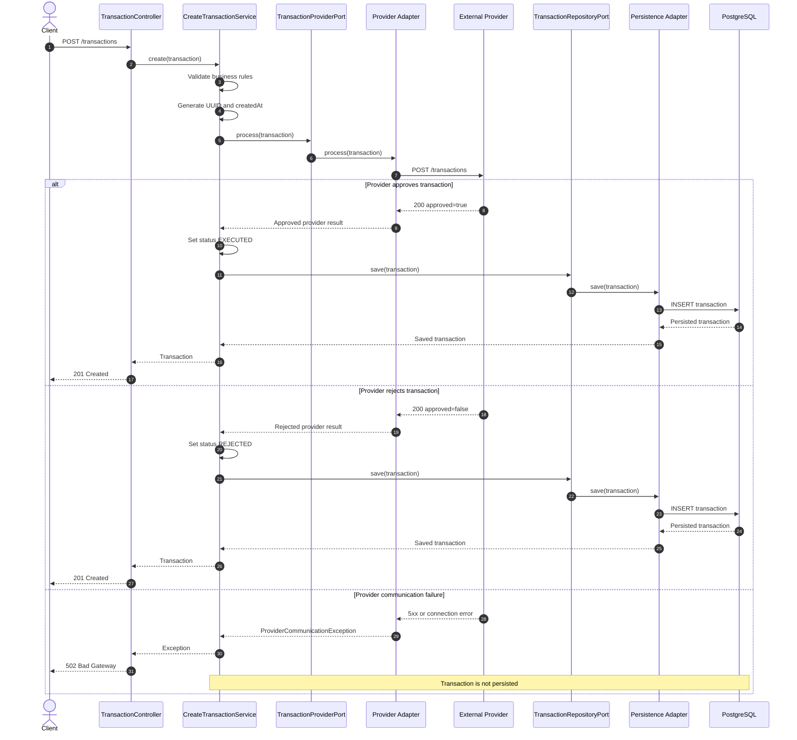
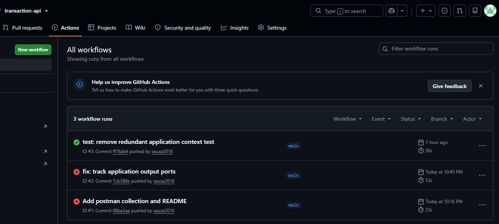
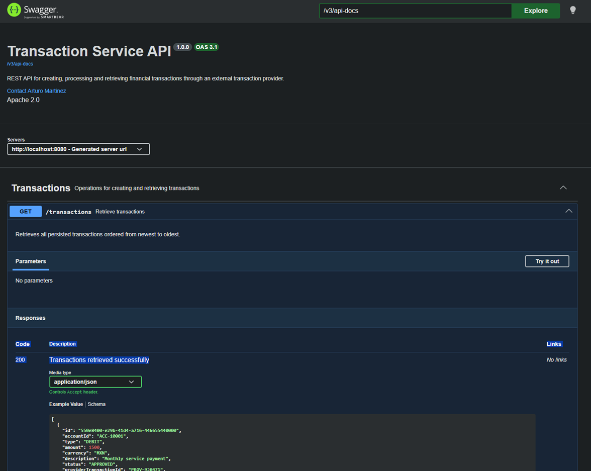
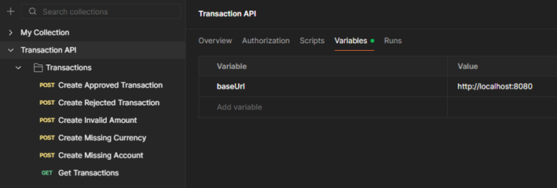

# Transaction Service
[](https://github.com/sauza2016/transaction-api/actions/workflows/ci.yml)


A RESTful API built with **Java 21** and **Spring Boot 4** for processing credit and debit transactions.

The application validates business rules, communicates with an external transaction provider, persists transaction records in PostgreSQL, and exposes REST endpoints for transaction creation and retrieval.

## Features

- RESTful Transaction API
- Hexagonal Architecture (Ports and Adapters)
- Java 21 & Spring Boot 4
- PostgreSQL persistence
- External transaction provider integration
- OpenAPI / Swagger UI
- Testcontainers + WireMock integration tests
- Docker Compose
- GitHub Actions CI
- Postman Collection with automated validations


---

## Architecture

The project follows **Hexagonal Architecture (Ports and Adapters)** to keep business logic independent from frameworks, persistence mechanisms, and external services.



<details>
<summary><strong>Mermaid Diagram</strong></summary>



</details>

### Dependency direction

```text
Controller → Application ports → Application services → Domain
Infrastructure adapters → Application output ports
Domain → No dependency on Spring, JPA, HTTP, or PostgreSQL
```

---

## Transaction Sequence

The following sequence describes the successful and rejected transaction flows, as well as provider communication failures.



---

## Technologies

- Java 21
- Spring Boot 4
- Spring Data JPA
- PostgreSQL 17
- Maven Wrapper
- Docker Compose
- Lombok
- Bean Validation
- Springdoc OpenAPI
- JUnit
- AssertJ
- Mockito
- MockMvc
- Testcontainers
- WireMock

---

## Design Principles

- Hexagonal Architecture
- Ports and Adapters
- Separation of Concerns
- Dependency Inversion
- SOLID principles
- DTO pattern
- Adapter pattern
- Builder pattern
- Centralized exception handling

---

## Project Structure

```text
src
├── main
│   ├── java
│   │   └── com.spin.transaction
│   │       ├── application
│   │       │   ├── port
│   │       │   │   ├── in
│   │       │   │   └── out
│   │       │   └── service
│   │       ├── controller
│   │       ├── domain
│   │       │   ├── enums
│   │       │   ├── exception
│   │       │   └── model
│   │       ├── dto
│   │       ├── infrastructure
│   │       │   ├── client
│   │       │   └── persistence
│   │       │       ├── adapter
│   │       │       ├── entity
│   │       │       └── repository
│   │       └── mapper
│   └── resources
│       └── application.yml
│
└── test
    ├── java
    │   └── com.spin.transaction
    │       ├── application
    │       ├── controller
    │       ├── infrastructure
    │       └── integration
    └── resources
        └── application-test.yml
```

> Package names may be adjusted to match the exact package structure in the repository.

---

## Prerequisites

- Java 21
- Docker Desktop

The Maven Wrapper is included, so a global Maven installation is not required.

---

## Running PostgreSQL

Start PostgreSQL with Docker Compose:

```bash
docker compose up -d
```

Verify that PostgreSQL is running:

```bash
docker compose ps
```

The command downloads the PostgreSQL image when necessary, creates the `transactions_db` database, and exposes PostgreSQL on port `5432`.

### Database connection

| Property | Value |
|---|---|
| Host | `localhost` |
| Port | `5432` |
| Database | `transactions_db` |
| Username | `postgres` |
| Password | `postgres` |

---

## Build

The build compiles the project and executes the complete test suite.

### Windows

```cmd
mvnw.cmd clean verify
```

### Linux and macOS

```bash
./mvnw clean verify
```

A successful build ends with:

```text
BUILD SUCCESS
```

---

## Running the Application

Make sure PostgreSQL is running before starting the application.

### Windows

```cmd
mvnw.cmd spring-boot:run
```

### Linux and macOS

```bash
./mvnw spring-boot:run
```

The application automatically creates the required database schema using Hibernate during startup.

The API starts at:

```text
http://localhost:8080
```

---

## Running Tests

### Windows

```cmd
mvnw.cmd test
```

### Linux and macOS

```bash
./mvnw test
```

To execute the complete verification lifecycle:

### Windows

```cmd
mvnw.cmd clean verify
```

### Linux and macOS

```bash
./mvnw clean verify
```

---

## REST Endpoints

| Method | Endpoint | Description | Success response |
|---|---|---|---|
| `POST` | `/transactions` | Create and process a transaction | `201 Created` |
| `GET` | `/transactions` | Retrieve persisted transactions | `200 OK` |

---

## Create Transaction

### Request

```http
POST /transactions
Content-Type: application/json
```

```json
{
  "accountId": "account-001",
  "type": "CREDIT",
  "amount": 500.00,
  "currency": "MXN",
  "description": "Account deposit"
}
```

### Approved response

```json
{
  "id": "2cbcb098-8e97-4aa5-b301-f1f461f30c80",
  "accountId": "account-001",
  "type": "CREDIT",
  "amount": 500.00,
  "currency": "MXN",
  "description": "Account deposit",
  "status": "EXECUTED",
  "providerTransactionId": "provider-tx-001",
  "balanceAfter": 15000.00,
  "createdAt": "2026-07-24T12:00:00Z"
}
```

### Rejected response

A transaction rejected by the external provider is still persisted and returned with status `REJECTED`.

```json
{
  "id": "46110c57-7be8-4a13-81ea-777f2036d367",
  "accountId": "account-002",
  "type": "DEBIT",
  "amount": 800.00,
  "currency": "MXN",
  "description": "Rejected transaction",
  "status": "REJECTED",
  "providerTransactionId": "provider-tx-002",
  "balanceAfter": 7500.00,
  "createdAt": "2026-07-24T12:05:00Z"
}
```

---

## Error Responses

| HTTP status | Scenario |
|---|---|
| `400 Bad Request` | Invalid input or business rule violation |
| `502 Bad Gateway` | External provider communication failure |

When provider communication fails, the transaction is not persisted.

---

## Transaction Statuses

| Status | Description |
|---|---|
| `EXECUTED` | The external provider approved the transaction |
| `REJECTED` | The external provider declined the transaction |

A `REJECTED` transaction is different from an invalid request:

- Invalid requests return `400 Bad Request` and are not processed.
- Provider-rejected requests return `201 Created` and are persisted with status `REJECTED`.

---

## Business Rules

- Only `MXN` is supported.
- The transaction amount must be greater than `1.00`.
- Debit transactions cannot exceed `10,000.00 MXN`.
- The external provider is invoked before persistence.
- Invalid requests return `400 Bad Request`.
- Provider-approved transactions are persisted with status `EXECUTED`.
- Provider-declined transactions are persisted with status `REJECTED`.
- Provider communication failures return `502 Bad Gateway`.
- Transactions are not persisted when provider communication fails.
- Retrieved transactions are ordered by creation date.

---

## External Provider

The application expects an external transaction provider at:

```text
http://localhost:8081
```

The URL is configured in `application.yml`:

```yaml
transaction:
  provider:
    base-url: http://localhost:8081
```

Integration tests do not require a real provider. WireMock starts a controlled HTTP server and simulates approved, rejected, and failure responses.

---

## Testing Strategy

The project includes:

- Unit tests for application services and business rules
- Controller tests with MockMvc
- Provider adapter tests
- Global exception handler tests
- Integration tests with PostgreSQL and the external provider boundary
- Automated API verification using the included Postman Collection

### Integration test stack

- Testcontainers
- PostgreSQL
- WireMock
- MockMvc
- AssertJ

### Covered integration scenarios

- Approved transaction creation
- Approved transaction persistence
- Rejected transaction creation
- Rejected transaction persistence
- External provider failure mapped to `502 Bad Gateway`
- No persistence after provider failure
- Transaction retrieval ordered by creation date

Testcontainers provides an isolated PostgreSQL instance, while WireMock provides deterministic external provider responses.

---

## Continuous Integration

The project includes a GitHub Actions pipeline that automatically:

- Builds the application
- Executes all unit tests
- Executes all integration tests
- Verifies the Maven build



---

## API Documentation

### Swagger UI Preview

The application exposes interactive API documentation through Swagger UI.



After starting the application, Swagger UI is available at:

```text
http://localhost:8080/swagger-ui.html
```

The OpenAPI specification is available at:

```text
http://localhost:8080/v3/api-docs
```

---


---

## Postman Collection

A Postman collection is included with the project to simplify manual API testing and endpoint validation.



### Location

```text
postman/Transaction_API.postman_collection.json
```

### Importing the Collection

1. Open **Postman**.
2. Click **Import**.
3. Select `postman/Transaction_API.postman_collection.json`.
4. Import the collection.

### Collection Variable

| Variable | Default Value |
|---|---|
| `baseUrl` | `http://localhost:8080` |

### Included Requests

| Request | Expected Result |
|---|---|
| Create Approved Transaction | `201 Created` |
| Create Rejected Transaction | `201 Created` |
| Create Invalid Amount | `400 Bad Request` |
| Create Missing Currency | `400 Bad Request` |
| Create Missing Account | `400 Bad Request` |
| Get Transactions | `200 OK` |

Each request includes automated Postman tests that validate the expected HTTP status code and response payload.

The collection can also be executed using the **Postman Collection Runner**.


## Main Design Decisions

- Business rules are implemented in the application/domain layers rather than controllers.
- REST DTOs are separated from domain models.
- JPA entities remain inside the infrastructure layer.
- Database access is encapsulated behind an output port and persistence adapter.
- External provider communication is isolated behind an output port and provider adapter.
- The domain does not depend on Spring MVC, JPA, PostgreSQL, or HTTP clients.
- Global exception handling provides consistent API error responses.
- Testcontainers avoids dependence on a developer's local PostgreSQL installation during integration tests.
- WireMock makes external provider tests deterministic and reproducible.

---

## Configuration

Main configuration:

```yaml
spring:
  application:
    name: transaction-api

  datasource:
    url: jdbc:postgresql://localhost:5432/transactions_db
    username: postgres
    password: postgres

  jpa:
    hibernate:
      ddl-auto: update
    open-in-view: false

transaction:
  provider:
    base-url: http://localhost:8081

server:
  port: 8080
```

For production environments, credentials and URLs should be provided through environment variables or a secrets manager rather than committed configuration values.

---

## Stopping PostgreSQL

Stop the container without deleting it:

```bash
docker compose stop
```

---

## Removing PostgreSQL

Remove the container while preserving the volume:

```bash
docker compose down
```

Remove the container and persisted database data:

```bash
docker compose down -v
```

---

## Future Improvements

- Introduce Flyway for database schema versioning.
- Add idempotency support to prevent duplicate transaction processing.
- Configure explicit connection and read timeouts for the external provider.
- Add retry and circuit breaker policies for transient provider failures.
- Add structured logging and correlation IDs.
- Add Micrometer and Prometheus observability.
- Add authentication and authorization.
- Add pagination to transaction retrieval.
- Add integration scenarios for timeouts and malformed provider responses.
- Replace local credentials with environment-based configuration.


---

## License

This project is licensed under the MIT License. See the [LICENSE](LICENSE) file for details.
